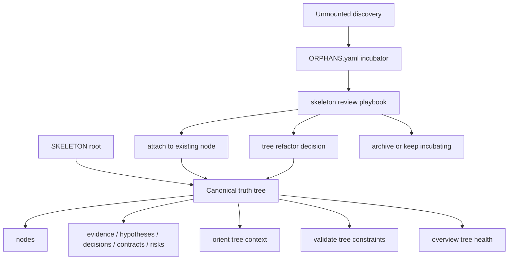

# feat: Add tree-governed truth growth

## Summary

This plan upgrades AletheiaOS from a repo-native truth layer into a tree-governed truth layer without replacing the existing control plane. The implementation should make `SKELETON.yaml` the canonical truth tree, route unknown material into a lightweight incubator/orphan flow, and surface tree health through the existing orient, validate, overview, skill, and capability-map surfaces.

---

## Problem Frame

AletheiaOS already maintains mission, system graph, skeleton, nodes, evidence, hypotheses, decisions, contracts, risks, and agent attribution. The new direction is not a second truth system; it is a stricter growth discipline: durable project truth should grow from root to trunk to branches to leaves, while unmounted discoveries are isolated until they can be attached, split, merged, or archived.

The risk is product bloat. If theory, claim, orphan, and tree-refactor become a parallel CRUD universe, AletheiaOS will duplicate its own primitives. This plan keeps the upgrade incremental by reusing existing records and adding only the smallest new durable surfaces needed to make the tree discipline visible and enforceable.

---

## Requirements

- R1. Preserve the current `.aletheia/` truth layer structure and avoid introducing a second tree/theory subsystem.
- R2. Treat `.aletheia/state/SKELETON.yaml` as the canonical truth tree, with root, parent, child, layer, and support-record relationships becoming explicit governance concepts.
- R3. Give agent workflows a clear way to handle material that does not yet belong on the main tree.
- R4. Make tree-governed growth hard to ignore by surfacing it in orient, validate, overview, playbooks, and capability discovery.
- R5. Keep validation staged: hard errors only for structural breakage, warnings for judgment-heavy health signals.
- R6. Preserve agent-native parity: any user-facing tree-governance action must have an agent-achievable path through existing primitives.
- R7. Keep scripts primitive; tree judgment belongs in playbooks, skills, templates, and review prompts.
- R8. Update documentation and tests so packaging, scaffold validation, and runtime behavior stay coherent.

---

## Scope Boundaries

- Do not add a database, vector store, long-running service, web UI, or external research ingestion system.
- Do not create separate `theories/`, `claims/`, or `tree/` truth-record directories in this iteration.
- Do not add a dedicated `tree_record.py` or new CRUD command family.
- Do not make all projects use high-intensity research governance by default.
- Do not let agents automatically rewrite root mission, root theory, or durable architecture decisions without human confirmation.
- Do not encode semantic judgment such as "child is truly supported by parent" as a hard validator in this iteration.

### Deferred to Follow-Up Work

- Full first-class theory registry: defer until the lightweight hypothesis/node-based approach proves insufficient.
- Quantitative tree health scoring: defer until warning signals are useful enough to calibrate.
- Automated similarity detection for overloaded siblings or duplicate branches: defer until there are enough real-world projects to tune against.
- Dedicated tree refactor command: defer unless decision-template reuse becomes too clumsy.

---

## Context & Research

### Relevant Code and Patterns

- `assets/scaffold/.aletheia/state/SKELETON.yaml` already has `root`, `layer`, `parent`, `children`, `purpose`, `invariants`, `contract_refs`, `decision_refs`, `evidence_refs`, and review metadata.
- `assets/scaffold/.aletheia/templates/NODE.yaml` already has `parent`, `children`, refs, and invalidation criteria, so node templates can be extended instead of replaced.
- `assets/scaffold/.aletheia/templates/HYPOTHESIS.md` already carries claim, evidence-needed, and invalidation fields; theory candidates can initially use hypotheses plus linked nodes.
- `assets/scaffold/.aletheia/templates/DECISION.md` already has status, affected nodes, evidence links, invalidation criteria, and review trigger; tree refactors can be represented as a decision type or template variant.
- `assets/scaffold/.aletheia/bin/validate.py` already validates scaffold paths, graph/skeleton alignment, skeleton refs, active nodes, model registry, action registry, capability map, and truth record semantics.
- `assets/scaffold/.aletheia/bin/orient.py` already prints project truth, active node, parent constraints, skeleton, linked evidence, linked contracts, record inventory, and a global view checksum.
- `assets/scaffold/.aletheia/bin/overview.py` already writes generated JSON/HTML with state files, validation, records, and recent changes.
- `assets/scaffold/.aletheia/CAPABILITY_MAP.md` already defines the action-parity and primitive matrix discipline.
- `docs/superpowers/plans/2026-05-06-aletheia-os-usability-closure-plan.md` explicitly says AletheiaOS core should stay a repo-native truth layer, not a workflow engine, and should use small documentation, validation, and skill improvements around the existing runtime.

### Institutional Learnings

- No `docs/solutions/` directory exists in this repo at planning time.
- The existing usability closure plan is the closest institutional precedent: add small scaffold/runtime/doc improvements, keep generated outputs separate, preserve primitive scripts, and avoid broad workflow engines.

### External References

- No external research is needed for this plan. The work is repo-local and extends existing Python standard-library scripts plus Markdown/YAML scaffold conventions.

---

## Key Technical Decisions

- Reuse current truth records instead of adding theory/claim CRUD: theory-like content starts as `hypotheses` linked to `nodes`, claim support stays in `evidence`, and tree restructuring is captured by `decisions`.
- Add one lightweight orphan/incubator state file rather than a new record family: unmounted material needs a visible holding area, but not full CRUD until real usage proves the need.
- Add tree governance as policy plus playbook first: the most important behavior is agent judgment and human review, so the durable guidance should live in governance/playbooks before scripts get stricter.
- Keep validate severity staged: root/parent/cycle/ref integrity can be hard errors; overloading, stale orphan review, weak evidence, and missing intermediate branches should initially be warnings.
- Make orient and overview carry the tree signal: templates alone are not enough. Agents need the active tree path, orphan state, and tree-health warnings in normal operating surfaces.
- Keep project profiles as a gate, not a new subsystem: stronger research rules should activate from `DOMAIN_PROFILE.md` guidance, not a separate configuration engine.

---

## Open Questions

### Resolved During Planning

- Should this be a rewrite or an extension? Resolution: extension. Existing skeleton, nodes, hypotheses, evidence, decisions, contracts, risks, and validation are already the right control plane.
- Should theory and claim become first-class directories immediately? Resolution: no. Reuse hypotheses/evidence/nodes first to avoid duplicate semantics.
- Is template-only expansion enough? Resolution: no. The tree discipline must enter orient, validate, overview, and playbooks or agents will ignore it.

### Deferred to Implementation

- Exact YAML field names for orphan review metadata: decide while updating the scaffold, keeping them readable and stable.
- Whether tree warnings should share the existing validation output shape or include a small structured subsection: decide while preserving current CLI behavior.
- Exact overview HTML layout for tree health: keep it minimal and adjust during implementation based on existing generated page structure.

---

## High-Level Technical Design

> *This illustrates the intended approach and is directional guidance for review, not implementation specification. The implementing agent should treat it as context, not code to reproduce.*

The key shape is a feedback loop around existing primitives. Agents still create/update/archive normal truth records, but now every durable truth update must answer where it belongs in the tree or why it remains incubated.

---

## Implementation Units

### U1. Add Tree Governance Policy And Incubator Scaffold

**Goal:** Establish the tree-governed truth growth rule in the default scaffold without changing runtime behavior yet.

**Requirements:** R1, R2, R3, R7

**Dependencies:** None

**Files:**
- Create: `assets/scaffold/.aletheia/governance/TREE_GOVERNANCE.md`
- Create: `assets/scaffold/.aletheia/state/ORPHANS.yaml`
- Modify: `assets/scaffold/.aletheia/state/DOMAIN_PROFILE.md`
- Modify: `assets/scaffold/.aletheia/state/SKELETON.yaml`
- Modify: `assets/scaffold/.aletheia/templates/NODE.yaml`
- Modify: `assets/scaffold/.aletheia/templates/HYPOTHESIS.md`
- Test: `tests/test_plugin_manifest.py`
- Test: `tests/test_runtime_validate.py`

**Approach:**
- Define root, parent, orphan, tree-refactor, and human-confirmation rules in `TREE_GOVERNANCE.md`.
- Add `ORPHANS.yaml` as a compact state file for unmounted observations, candidate nodes, candidate parents, review dates, and disposition.
- Extend `SKELETON.yaml` and `NODE.yaml` only with fields that reinforce existing semantics: layer, parent, inherited constraints, support refs, review triggers, and confidence.
- Extend `HYPOTHESIS.md` enough to represent theory candidates without adding a `theory` entity.
- Add domain-profile language that stronger research-tree governance applies to scientific, quantitative, AI, and hybrid research profiles.

**Patterns to follow:**
- Existing `assets/scaffold/.aletheia/governance/*.md` policy documents.
- Existing compact YAML style in `SKELETON.yaml` and `NODE.yaml`.
- Existing semantic truth-record checks in `validate.py`.

**Test scenarios:**
- Happy path: packaging/scaffold tests confirm the new governance and orphan state files exist in packaged output.
- Happy path: initializing a target repo includes `TREE_GOVERNANCE.md` and `ORPHANS.yaml`.
- Edge case: default `ORPHANS.yaml` with no orphan entries validates cleanly.
- Edge case: default scaffold remains bootstrap-friendly and does not fail because root details are still `TBD`.

**Verification:**
- The default scaffold contains the new governance and incubator files.
- The default scaffold still validates in bootstrap mode.
- No new truth-record directory or command family is introduced.

---

### U2. Add Tree Validation Checks With Staged Severity

**Goal:** Make tree structure enforceable enough to protect integrity while keeping semantic judgment as warnings.

**Requirements:** R2, R3, R5, R8

**Dependencies:** U1

**Files:**
- Modify: `assets/scaffold/.aletheia/bin/validate.py`
- Test: `tests/test_runtime_validate.py`

**Approach:**
- Extend graph/skeleton validation beyond root-child matching to check root existence, parent existence, invalid layers, and cycles.
- Validate skeleton support refs using the existing ref-resolution pattern.
- Validate `ORPHANS.yaml` shape lightly: required top-level structure, no path traversal in refs, candidate parents are either known nodes or explicitly marked unknown.
- Treat structural failures as errors.
- Treat health signals as warnings: stale orphan review, too many children under one node, leaf with weak support, missing review dates, or speculative records not clearly marked.

**Patterns to follow:**
- Existing error/warning split in `validate.py`.
- Existing tests around skeleton refs and semantic truth-record checks in `tests/test_runtime_validate.py`.

**Test scenarios:**
- Happy path: a valid parent/child skeleton with empty orphan list passes.
- Error path: a skeleton node with a missing parent fails validation.
- Error path: a skeleton cycle fails validation.
- Error path: malformed `ORPHANS.yaml` fails with a clear message and no traceback.
- Warning path: stale orphan review produces a warning without failing validation.
- Warning path: overloaded node or unsupported leaf produces a warning without failing validation.

**Verification:**
- Validation protects hard tree integrity.
- Judgment-heavy conditions remain non-blocking warnings.
- Existing validation tests still pass without broad fixture rewrites.

---

### U3. Surface Tree Context In Orient And System Context

**Goal:** Make agents see the active tree path and orphan/incubator state during normal orientation.

**Requirements:** R2, R3, R4, R6

**Dependencies:** U1

**Files:**
- Modify: `assets/scaffold/.aletheia/bin/orient.py`
- Modify: `assets/scaffold/.aletheia/bin/context_pack.py`
- Modify: `assets/scaffold/.aletheia/bin/system_context.py`
- Test: `tests/test_runtime_validate.py`

**Approach:**
- Add a compact tree-governance section to orientation output: root, active node, parent path when discoverable, child nodes, linked support records, and orphan summary.
- Add a tree-specific line to the global view checksum so agents explicitly consider tree attachment, incubator routing, and required truth updates.
- Keep output cache-friendly: do not dump full orphan bodies by default if a summary is enough.
- Preserve runtime opt-in behavior; high-churn session records remain behind existing flags.

**Patterns to follow:**
- Existing `orient.py` stable-first output.
- Existing `context_pack.py` and `system_context.py` distinction between stable context and optional runtime context.

**Test scenarios:**
- Happy path: orient output includes tree governance context on a default initialized repo.
- Happy path: orient output includes an orphan summary when `ORPHANS.yaml` contains incubating entries.
- Edge case: missing `ORPHANS.yaml` reports a warning rather than crashing.
- Regression: `--static` and `--with-runtime` behavior remains unchanged except for stable tree context.

**Verification:**
- Agents can answer "where does this belong in the tree?" from orientation output.
- Orientation remains compact and does not become a full generated report.

---

### U4. Add Playbooks And Skill Guidance For Tree Workflows

**Goal:** Put tree judgment in prompt-native guidance rather than runtime scripts.

**Requirements:** R3, R6, R7, R8

**Dependencies:** U1

**Files:**
- Create: `assets/scaffold/.aletheia/playbooks/tree_governed_truth_growth.md`
- Create: `assets/scaffold/.aletheia/playbooks/skeleton_review.md`
- Modify: `assets/scaffold/.aletheia/playbooks/wiki_handoff_promotion.md`
- Modify: `assets/scaffold/.aletheia/playbooks/prompt_native_boundaries.md`
- Modify: `skills/aletheia-orient/SKILL.md`
- Modify: `skills/aletheia-architecture-evolution/SKILL.md`
- Modify: `skills/aletheia-design-evidence/SKILL.md`
- Modify: `skills/aletheia-promote/SKILL.md`
- Test: `tests/test_plugin_manifest.py`
- Test: `tests/test_external_wiki_intake_boundary.py`

**Approach:**
- Add a tree-governed growth playbook covering attach, incubate, split, merge, archive, promote, demote, and insert-parent decisions at workflow level.
- Add a skeleton review playbook that tells agents how to periodically review overloaded nodes, stale orphans, weak branches, and branch promotion opportunities.
- Update wiki handoff promotion so candidate skeletons, theory candidates, counter-evidence, and "do not promote yet" sections map to existing records or incubator entries.
- Update skills so tree changes reuse `orient.py`, `truth_record.py`, direct state-file edits, `validate.py`, and `checkpoint.py`.
- Explicitly state that runtime scripts should not decide tree semantics automatically.

**Patterns to follow:**
- Existing `skills/*/SKILL.md` sections for Primitive Capabilities and Prompt Recipe.
- Existing `wiki_handoff_promotion.md` checklist style.
- Existing `prompt_native_boundaries.md` primitive-to-workflow discipline.

**Test scenarios:**
- Happy path: plugin package includes the new playbooks.
- Happy path: workflow skills mention tree attachment/incubator rules and still declare primitive capabilities.
- Happy path: wiki handoff promotion includes candidate skeleton, counter-evidence, and do-not-promote handling.
- Regression: tests still confirm scripts remain primitive and workflows stay in skills/playbooks.

**Verification:**
- Agents have clear prompt-level instructions for tree growth without new orchestration scripts.
- Existing promotion and architecture evolution skills now route ambiguous discoveries through incubator/review rather than forcing premature tree edits.

---

### U5. Add Tree Health To Overview And Status Surfaces

**Goal:** Make the human-facing overview show whether the truth tree is coherent without turning overview into a full research dashboard.

**Requirements:** R3, R4, R5, R8

**Dependencies:** U1, U2

**Files:**
- Modify: `assets/scaffold/.aletheia/bin/overview.py`
- Modify: `assets/scaffold/.aletheia/bin/status.py`
- Test: `tests/test_runtime_validate.py`

**Approach:**
- Add a small structured tree-health payload to generated overview JSON: root present, node count, orphan count, validation tree errors/warnings, and review-needed count.
- Add a compact HTML section for tree health and incubator summary.
- Add status output that mentions tree/orphan health without duplicating overview.
- Reuse validation output where possible instead of implementing a second analyzer.

**Patterns to follow:**
- Existing overview generated JSON plus minimal HTML table/pre sections.
- Existing status summary style with JSON and text modes.

**Test scenarios:**
- Happy path: overview status JSON includes tree health fields on default scaffold.
- Happy path: overview HTML shows tree health and orphan count.
- Warning path: stale orphan appears in validation and overview tree-health summary.
- Regression: overview still defaults to `.aletheia/overview/` and `--public-docs` still exports to `docs/overview/`.

**Verification:**
- Users can quickly see whether the truth tree is healthy.
- Overview remains generated/intermediate output, not durable truth.

---

### U6. Update Capability Map, Actions, README, And Packaging Expectations

**Goal:** Keep agent-native parity and public documentation aligned with the new tree-governance workflow.

**Requirements:** R4, R6, R8

**Dependencies:** U1, U4, U5

**Files:**
- Modify: `assets/scaffold/.aletheia/CAPABILITY_MAP.md`
- Modify: `assets/scaffold/.aletheia/governance/actions.json`
- Modify: `assets/scaffold/START_HERE.md`
- Modify: `assets/scaffold/BOOTSTRAP.md`
- Modify: `README.zh-CN.md`
- Modify: `docs/articles/aletheia-os-project-introduction.zh-CN.md`
- Test: `tests/test_plugin_manifest.py`
- Test: `tests/test_runtime_validate.py`

**Approach:**
- Add user-facing actions for reviewing tree governance, routing orphan material, reviewing skeleton health, and performing tree refactor decisions using existing primitives.
- Add action contracts only where they run existing scripts or explain existing capabilities. Avoid adding actions that imply a missing automated workflow.
- Update README and article language from "repo-native truth layer" to "tree-governed repo-native truth layer" where appropriate, while preserving the boundary that AletheiaOS is not a task manager, workflow engine, or external wiki.
- Keep quick start simple; do not put the full tree model above the daily loop.

**Patterns to follow:**
- Existing capability-map action table, primitive matrix, CRUD matrix, and maintenance rule.
- Existing README separation between quick start, daily loop, `.aletheia/` contents, external wiki intake, runtime reference, and design principles.

**Test scenarios:**
- Happy path: capability map contains the new tree-governance action terms.
- Happy path: capability audit passes after map/action updates.
- Happy path: README includes the tree-governance principle without losing the simple daily loop.
- Regression: packaging includes all new scaffold and playbook files.

**Verification:**
- The documented user actions have corresponding agent capabilities.
- Public docs communicate the new direction without making the product look heavier than it is.

---

### U7. Add Focused End-To-End Scaffold Tests

**Goal:** Prove the new tree-governance loop works across init, orient, validate, overview, and packaging.

**Requirements:** R1, R4, R5, R6, R8

**Dependencies:** U1, U2, U3, U5, U6

**Files:**
- Modify: `tests/test_runtime_validate.py`
- Modify: `tests/test_plugin_manifest.py`
- Modify: `tests/test_init_greenfield.py`
- Modify: `tests/test_research_iteration_flow.py`

**Approach:**
- Add one greenfield initialization test that confirms tree governance files are copied and default validation succeeds.
- Add one runtime flow test that creates or edits an incubator/orphan entry, runs orient, runs validate, and generates overview.
- Add one research iteration flow test that proves a candidate finding can remain incubated without being promoted prematurely.
- Keep tests behavior-focused and avoid overfitting to exact prose where possible.

**Patterns to follow:**
- Existing temporary target initialization helpers in `tests/test_runtime_validate.py`.
- Existing package and capability-map assertions in `tests/test_plugin_manifest.py`.
- Existing research flow coverage in `tests/test_research_iteration_flow.py`.

**Test scenarios:**
- Happy path: initialized target contains tree governance policy, orphan state, and validates.
- Happy path: an orphan candidate appears in orient and overview.
- Warning path: stale orphan review is visible but non-blocking.
- Regression: full scaffold validation still passes.

**Verification:**
- A maintainer can see the tree-governance loop working without manual inspection.
- Tests guard the anti-bloat boundary by asserting no separate theory/claim/tree CRUD is required for the default path.

---

## System-Wide Impact

- **Interaction graph:** The daily loop remains `orient -> work -> update truth -> validate -> checkpoint`; tree governance enriches orient/update/validate but does not add a new top-level loop.
- **Error propagation:** Structural tree defects should fail validation; health concerns should warn and appear in status/overview.
- **State lifecycle risks:** Orphan entries are durable state, not generated output. Overview tree health remains generated output under `.aletheia/overview/`.
- **API surface parity:** User-facing tree actions must be discoverable in `CAPABILITY_MAP.md` and achievable through existing scripts, direct state edits, skills, and playbooks.
- **Integration coverage:** Init, validate, orient, status, overview, package, and capability audit need cross-surface tests.
- **Unchanged invariants:** Truth records remain archive-by-default; scripts remain primitive; root-level changes require human confirmation; external LLM Wiki remains outside core.

---

## Risks & Dependencies

| Risk | Mitigation |
|------|------------|
| Tree governance becomes a parallel product inside AletheiaOS | Reuse `SKELETON.yaml`, nodes, hypotheses, evidence, decisions, contracts, and risks; defer first-class theory/claim directories. |
| Template fields are added but agents ignore them | Update orient, validate, overview, skills, and playbooks together so tree context appears in normal operation. |
| Validation becomes too opinionated and blocks early research projects | Stage severity: hard errors for structure, warnings for health and semantic judgment. |
| Orphans become a dumping ground | Add review dates, candidate parents, dispositions, and overview/status visibility. |
| README becomes too complex | Keep daily loop and quick start first; move tree details into governance/playbooks and focused sections. |
| Tests become brittle because they assert exact prose | Prefer existence, key term, and behavior assertions over full text snapshots. |

---

## Documentation / Operational Notes

- README should present tree governance as a refinement of the truth layer, not a new workflow.
- `TREE_GOVERNANCE.md` should be the durable policy source for root, parent, orphan, and tree-refactor rules.
- Playbooks should carry judgment-heavy instructions; runtime scripts should only inspect, summarize, and validate.
- Capability map updates are mandatory whenever a new user-facing tree action is described.

---

## Alternative Approaches Considered

- Full first-class theory/claim/tree entity model: rejected for this iteration because it duplicates existing hypotheses/evidence/nodes/decisions and creates carrying cost before real usage proves the need.
- Template-only expansion: rejected because agents are likely to ignore fields that do not appear in orient, validate, overview, or playbooks.
- Validator-first hard enforcement: rejected because early research projects need incubator space and warnings before strict structure becomes reliable.
- New tree command-line tool: rejected because existing `truth_record.py`, direct state edits, and playbooks already provide the required primitives.

---

## Phased Delivery

### Phase 1: Governance And Scaffold Shape

- Land U1 and U4 first so the product contract is explicit before runtime behavior changes.
- Keep validation permissive while the default scaffold shape settles.

### Phase 2: Runtime Visibility And Validation

- Land U2, U3, and U5 together or in close sequence so tree fields are visible and checked.
- Keep warnings non-blocking unless structural integrity is broken.

### Phase 3: Public Parity And Regression Coverage

- Land U6 and U7 to align docs, capability map, package output, and end-to-end tests.

---

## Sources & References

- Discussion source: `docs/ChatGPT-Branch_·_系统模型核心树干.md`
- Current product overview: `README.zh-CN.md`
- Prior plan precedent: `docs/superpowers/plans/2026-05-06-aletheia-os-usability-closure-plan.md`
- Existing skeleton: `assets/scaffold/.aletheia/state/SKELETON.yaml`
- Existing node template: `assets/scaffold/.aletheia/templates/NODE.yaml`
- Existing hypothesis template: `assets/scaffold/.aletheia/templates/HYPOTHESIS.md`
- Existing decision template: `assets/scaffold/.aletheia/templates/DECISION.md`
- Existing validator: `assets/scaffold/.aletheia/bin/validate.py`
- Existing orient runtime: `assets/scaffold/.aletheia/bin/orient.py`
- Existing overview runtime: `assets/scaffold/.aletheia/bin/overview.py`
- Existing capability map: `assets/scaffold/.aletheia/CAPABILITY_MAP.md`
