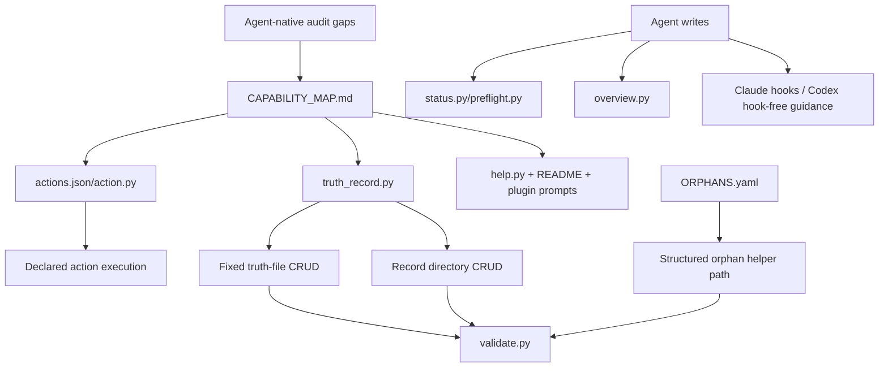

# feat: Harden agent-native architecture coverage

## Summary

This plan turns the agent-native audit findings into a focused iteration for AletheiaOS. The work should raise the repo's agent-native completeness by closing structured CRUD gaps, making orphan/incubator work first-class enough for agents, separating primitive runtime capabilities from workflow wrappers, and improving hook-free Codex discovery and refresh paths.

---

## Problem Frame

The current architecture is already strongly agent-native for a repo-native CLI/plugin system: it has `.aletheia/` as a shared workspace, capability mapping, prompt-ready context generation, action contracts, model attribution, and truth-record CRUD. The remaining risk is uneven completeness: some user-visible actions still depend on direct file edits or host UI, several scripts mix primitive capability with workflow orchestration, and Codex users need more explicit hook-free feedback loops because Claude hooks are the only automatic UI/update mechanism.

---

## Assumptions

*This plan was authored from the agent-native audit findings without a separate brainstorm requirements document. The items below are agent inferences that should be reviewed before implementation proceeds.*

- The next iteration should optimize for architecture completeness and maintainability rather than adding new product scope.
- Archive-by-default remains the correct Delete equivalent for durable truth records.
- Codex plugin enablement remains a host limitation; this plan should improve surrounding repo-native guidance rather than pretending the repository can automate `/plugins`.
- Runtime scripts should keep deterministic checks and filesystem mechanics in Python, while judgment-heavy sequencing stays in skills and playbooks.

---

## Requirements

- R1. Improve agent-native audit coverage without introducing a database, service, web UI, or separate truth subsystem.
- R2. Give every normal durable truth surface a structured agent path for create/read/update/archive or a documented reason it is intentionally manual/admin-only.
- R3. Make orphan/incubator truth work discoverable and executable by agents without requiring ad hoc YAML edits for the common cases.
- R4. Preserve primitive-first design by separating runtime capabilities from prompt-level workflow judgment.
- R5. Improve hook-free Codex operation so agents can discover next actions, refresh status, and see consequences of writes through repo-native surfaces.
- R6. Keep capability discovery aligned across `README.zh-CN.md`, plugin manifests, skills, `help.py`, `actions.json`, and `CAPABILITY_MAP.md`.
- R7. Add tests that prevent drift between user-facing actions, agent-facing action contracts, CRUD coverage, and runtime validation behavior.
- R8. Preserve existing scaffold/package behavior and the current 159-test baseline.

---

## Scope Boundaries

- Do not add a front-end app or live UI just to satisfy UI Integration; AletheiaOS's primary shared surface remains repository files and generated local reports.
- Do not add MCP tooling in this iteration; existing repo-native scripts remain the agent primitive layer.
- Do not make permanent deletion a normal agent primitive for durable truth records.
- Do not automate Codex plugin enablement through unsupported host internals.
- Do not rewrite `checkpoint.py`, `bootstrap_finalize.py`, or `guided_bootstrap.py` wholesale; decompose only where it clarifies primitives and preserves behavior.
- Do not change the truth model's product identity from project truth control plane into a general coding workflow.

### Deferred to Follow-Up Work

- Host-native slash commands if Codex/Claude plugin APIs expose a stable command surface later.
- A true interactive UI around `.aletheia/overview/`.
- MCP server exposure of AletheiaOS primitives after the CLI/action layer proves stable.
- Re-running the full `compound-engineering:ce-agent-native-audit` as an automated CI report.

---

## Context & Research

### Relevant Code and Patterns

- `assets/scaffold/.aletheia/CAPABILITY_MAP.md` already documents user actions, agent capabilities, primitive matrix, and CRUD matrix.
- `assets/scaffold/.aletheia/governance/actions.json` declares agent-native action contracts and recommended actions.
- `assets/scaffold/.aletheia/bin/action.py` lists, explains, recommends, and runs declared action contracts.
- `assets/scaffold/.aletheia/bin/truth_record.py` provides create/list/show/update/archive for record entities and a smaller fixed-file set.
- `assets/scaffold/.aletheia/bin/system_context.py`, `context_pack.py`, `orient.py`, `status.py`, `preflight.py`, and `overview.py` provide dynamic context and hook-free refresh surfaces.
- `assets/scaffold/.aletheia/playbooks/prompt_native_boundaries.md` already classifies primitive runtime scripts vs workflow-coded scripts.
- `skills/aletheia-*.md` files already express workflow judgment as prompt recipes over primitive capabilities.
- `tests/test_runtime_validate.py`, `tests/test_model_gate.py`, `tests/test_checkpoint.py`, and `tests/test_subagents.py` provide broad runtime, CRUD, hook, package, and agent-surface coverage.

### Institutional Learnings

- No `docs/solutions/` directory exists in this repo at planning time.
- The existing `docs/plans/2026-05-08-001-feat-tree-governed-truth-plan.md` is the closest planning precedent: extend existing truth-layer primitives, keep judgment in playbooks/skills, and avoid parallel CRUD universes.

### External References

- No external research is needed for this iteration. The work is repo-local and extends Python standard-library scripts, Markdown/YAML scaffold files, plugin manifests, and the existing test suite.

---

## Key Technical Decisions

- Close CRUD gaps through `truth_record.py` and `actions.json` before inventing new commands: the repo already has a stable CRUD primitive; the iteration should expand its supported fixed entities and action coverage.
- Add a narrow orphan helper instead of a new orphan record family: common list/add/update/archive operations should be structured, while broad YAML rewrites remain possible for complex reviews.
- Keep workflow wrappers but name their primitive boundaries: scripts such as `checkpoint.py` and `bootstrap_finalize.py` can stay as user-facing workflows if their deterministic sub-capabilities are visible, testable, and documented as composed primitives.
- Treat repo-generated status as the UI Integration surface: `status.py`, `preflight.py`, `overview.py`, and hook logs are the correct immediate-feedback mechanisms for a CLI/plugin project.
- Use capability drift tests as the regression guard: action contracts, capability-map rows, CRUD matrix entries, help output, and packaged files should be checked together.

---

## Open Questions

### Resolved During Planning

- Should this plan target a live UI? Resolution: no. The agent-native audit criterion maps to repo-native refresh/report surfaces for this project.
- Should durable truth records get hard delete? Resolution: no. Archive remains the normal Delete equivalent.
- Should workflow-coded scripts be removed? Resolution: no. Keep wrappers where they provide user value, but make their primitive boundaries more explicit and tested.

### Deferred to Implementation

- Exact fixed-entity aliases to add first: choose the smallest useful set while updating `CAPABILITY_MAP.md` and tests together.
- Exact orphan helper interface: decide while preserving readable `ORPHANS.yaml` and avoiding a second record system.
- Whether action-contract CRUD should live entirely in `truth_record.py` fixed entities or partly in `action.py`: decide based on the cleanest CLI/user vocabulary split during implementation.

---

## High-Level Technical Design

> *This illustrates the intended approach and is directional guidance for review, not implementation specification. The implementing agent should treat it as context, not code to reproduce.*

The desired shape is still a small CLI/action layer over shared repository files. Agents should discover what they can do from the action and capability surfaces, perform structured changes through primitives, validate the result, and refresh status through repo-native reports.

---

## Implementation Units

### U1. Expand Fixed Truth Entity CRUD Coverage

**Goal:** Give agents structured read/update/archive paths for the fixed governance and state files currently documented as direct edits or partial CRUD.

**Requirements:** R1, R2, R6, R7

**Dependencies:** None

**Files:**
- Modify: `assets/scaffold/.aletheia/bin/truth_record.py`
- Modify: `assets/scaffold/.aletheia/CAPABILITY_MAP.md`
- Modify: `assets/scaffold/.aletheia/bin/help.py`
- Test: `tests/test_runtime_validate.py`

**Approach:**
- Extend the existing fixed-entity map in `truth_record.py` for the important governance/state files not yet covered by structured aliases.
- Preserve the existing `current` record id convention for fixed files.
- Keep broad rewrites possible through direct file edits, but make normal show/update/archive actions discoverable and test-backed.
- Update the CRUD matrix so fixed files are not documented more strongly than the CLI actually supports.

**Patterns to follow:**
- Existing fixed entities such as `active-state`, `capability-map`, `runtime-policy`, and `system-graph` in `truth_record.py`.
- Existing admin CRUD tests in `tests/test_runtime_validate.py`.

**Test scenarios:**
- Happy path: `truth_record.py show <fixed-entity> current --json` returns the expected path and content for each newly supported entity.
- Happy path: markdown fixed entities can update a named section without changing unrelated sections.
- Edge case: non-markdown fixed entities reject section updates with a clear error.
- Error path: any fixed entity called with an id other than `current` fails clearly.
- Regression: existing record-directory CRUD behavior is unchanged.

**Verification:**
- The fixed truth files listed in `CAPABILITY_MAP.md` have matching `truth_record.py` entity support or an explicit manual/admin note.
- The scaffold validation and runtime tests pass.

---

### U2. Add Structured Orphan / Incubator Operations

**Goal:** Make the common orphan/incubator workflow agent-achievable without relying on ad hoc YAML edits for every operation.

**Requirements:** R2, R3, R4, R5, R7

**Dependencies:** U1

**Files:**
- Modify: `assets/scaffold/.aletheia/bin/truth_record.py`
- Modify: `assets/scaffold/.aletheia/governance/actions.json`
- Modify: `assets/scaffold/.aletheia/CAPABILITY_MAP.md`
- Modify: `assets/scaffold/.aletheia/bin/validate.py`
- Test: `tests/test_runtime_validate.py`

**Approach:**
- Add a narrow structured path for listing, showing, adding, updating status, and archiving orphan entries in `ORPHANS.yaml`.
- Keep the durable storage as `ORPHANS.yaml`; do not create `.aletheia/orphans/`.
- Require enough fields to keep reviewable context: id, claim or summary, candidate parent, source refs, status, and review trigger.
- Add action contracts for common orphan operations if they can be expressed cleanly without making `actions.json` a second schema engine.
- Validate malformed orphan entries with clear errors and treat stale review signals according to existing tree-health warning behavior.

**Patterns to follow:**
- Existing archive-by-default policy in `truth_record.py`.
- Existing action contract shape in `actions.json`.
- Existing tree health and orphan validation tests from the tree-governed truth work.

**Test scenarios:**
- Happy path: an agent can create an orphan entry, list it, show it, update its status, and archive it.
- Edge case: duplicate orphan ids are rejected.
- Edge case: candidate parent can be unknown only when explicitly marked as such.
- Error path: malformed `ORPHANS.yaml` reports a clear validation error without traceback.
- Integration: newly added orphan action contracts pass `action.py explain` and `action.py run` argument resolution tests.

**Verification:**
- Common incubator work is represented in the capability map and action layer.
- Agents no longer need to hand-edit YAML for the normal orphan lifecycle.

---

### U3. Clarify Primitive Boundaries For Workflow-Coded Runtime Scripts

**Goal:** Reduce the "workflow-coded script" audit penalty without breaking valuable user-facing wrappers.

**Requirements:** R1, R4, R7, R8

**Dependencies:** None

**Files:**
- Modify: `assets/scaffold/.aletheia/playbooks/prompt_native_boundaries.md`
- Modify: `assets/scaffold/.aletheia/bin/checkpoint.py`
- Modify: `assets/scaffold/.aletheia/bin/bootstrap_finalize.py`
- Modify: `assets/scaffold/.aletheia/bin/guided_bootstrap.py`
- Modify: `assets/scaffold/.aletheia/governance/actions.json`
- Modify: `assets/scaffold/.aletheia/CAPABILITY_MAP.md`
- Test: `tests/test_checkpoint.py`
- Test: `tests/test_bootstrap_finalize.py`
- Test: `tests/test_runtime_validate.py`

**Approach:**
- Keep existing workflow wrappers for user ergonomics.
- Identify deterministic sub-capabilities that are useful as primitives, such as checkpoint candidate inspection, bootstrap readiness inspection, or guided inventory report generation.
- Prefer adding read-only or dry-run primitives over splitting stable scripts into many small commands.
- Update `prompt_native_boundaries.md` with a more explicit "wrapper over primitives" classification so future contributors know where to put new behavior.
- Avoid moving judgment-heavy decisions into Python; prompt recipes remain responsible for deciding whether the wrapper should be invoked.

**Patterns to follow:**
- Existing `checkpoint.py --dry-run` behavior.
- Existing `preflight.py` read-only checkpoint candidate report.
- Existing `action.py` risk labels for `read-only`, `writes-state`, `admin`, and `checkpoint`.

**Test scenarios:**
- Happy path: read-only/dry-run primitive actions expose the same candidate information as current wrapper outputs.
- Regression: default checkpoint still stages only durable state paths.
- Regression: bootstrap finalize still validates, writes session note, installs hooks, and checkpoints unless skipped.
- Error path: primitive inspection reports blocked states without mutating files.
- Integration: `CAPABILITY_MAP.md` and `actions.json` stay aligned for any newly exposed primitive.

**Verification:**
- The audit can classify more runtime surface as primitive or primitive-wrapper rather than opaque workflow.
- Existing workflow commands remain available and tested.

---

### U4. Strengthen Hook-Free Codex Feedback Loops

**Goal:** Improve UI Integration for Codex and other hosts without Claude-style automatic hooks by making status refresh, preflight, overview, and next actions harder to miss.

**Requirements:** R5, R6, R7, R8

**Dependencies:** U2, U3

**Files:**
- Modify: `assets/scaffold/.aletheia/bin/status.py`
- Modify: `assets/scaffold/.aletheia/bin/preflight.py`
- Modify: `assets/scaffold/.aletheia/bin/overview.py`
- Modify: `assets/scaffold/.aletheia/bin/help.py`
- Modify: `assets/scaffold/.aletheia/CAPABILITY_MAP.md`
- Modify: `skills/aletheia-orient/SKILL.md`
- Modify: `skills/aletheia-checkpoint/SKILL.md`
- Modify: `README.zh-CN.md`
- Test: `tests/test_runtime_validate.py`

**Approach:**
- Make hook-free status surfaces explicitly show "what changed", "what to run next", and whether generated/runtime outputs are durable truth or local status.
- Ensure `preflight.py --json` and `status.py --json` expose enough machine-readable fields for agents to decide next steps without scraping prose.
- Keep `overview.py` as generated local UI, not durable truth by default.
- Update skills and README to tell Codex users which explicit refresh commands replace Claude's automatic hook feedback.

**Patterns to follow:**
- Existing `preflight.py` `recommended_actions` field.
- Existing `status.py` recent change and tree health reporting.
- Existing `overview.py --public-docs` distinction between local generated output and public docs.

**Test scenarios:**
- Happy path: after a simulated runtime change log, status and overview both surface the change.
- Happy path: preflight returns recommended action ids and matching command hints.
- Edge case: missing runtime records produce useful "none recorded" output instead of failure.
- Regression: generated runtime, source inventory, and overview files remain excluded from default checkpoint candidates.
- Integration: help output points Codex users to hook-free refresh commands.

**Verification:**
- Codex users can recover the same loop manually: orient, work, refresh status, validate, dry-run checkpoint.
- No generated status file is accidentally promoted to durable truth.

---

### U5. Align Capability Discovery Across Surfaces

**Goal:** Keep user-facing docs, plugin metadata, skills, action contracts, and capability-map entries mutually consistent.

**Requirements:** R2, R5, R6, R7

**Dependencies:** U1, U2, U3, U4

**Files:**
- Modify: `.codex-plugin/plugin.json`
- Modify: `.claude-plugin/plugin.json`
- Modify: `assets/scaffold/.aletheia/bin/help.py`
- Modify: `assets/scaffold/.aletheia/CAPABILITY_MAP.md`
- Modify: `assets/scaffold/.aletheia/governance/actions.json`
- Modify: `skills/aletheia-bootstrap/SKILL.md`
- Modify: `skills/aletheia-orient/SKILL.md`
- Modify: `skills/aletheia-checkpoint/SKILL.md`
- Modify: `skills/aletheia-promote/SKILL.md`
- Modify: `skills/aletheia-architecture-evolution/SKILL.md`
- Modify: `README.zh-CN.md`
- Test: `tests/test_plugin_manifest.py`
- Test: `tests/test_runtime_validate.py`

**Approach:**
- Update default prompts and help sections only where they improve discovery of existing workflows.
- Make skill "Primitive Capabilities" lists match the actual action/CLI surface after U1-U4.
- Add a capability-map maintenance rule that new action ids require help/docs/test updates when user-visible.
- Preserve the Codex plugin `defaultPrompt` length and count constraints.

**Patterns to follow:**
- Existing concise plugin manifest defaults.
- Existing skill structure: `Primitive Capabilities` plus `Prompt Recipe`.
- Existing `validate.py` and `validate_scaffold.py` capability-map required-term checks.

**Test scenarios:**
- Happy path: plugin manifest smoke tests still pass.
- Happy path: each new action id is documented in `CAPABILITY_MAP.md` or intentionally marked internal.
- Edge case: default prompts stay within manifest limits.
- Regression: optional review agents remain small, read-focused, and not installed into default scaffold.

**Verification:**
- A user or agent can discover the new iteration's capabilities from README, help, actions, and skills without conflicting guidance.

---

### U6. Add Agent-Native Drift Tests And Audit Fixtures

**Goal:** Prevent the same audit gaps from reappearing as the action layer evolves.

**Requirements:** R6, R7, R8

**Dependencies:** U1, U2, U3, U4, U5

**Files:**
- Create: `tests/test_agent_native_coverage.py`
- Modify: `scripts/validate_scaffold.py`
- Modify: `assets/scaffold/.aletheia/bin/validate.py`
- Test: `tests/test_agent_native_coverage.py`

**Approach:**
- Add tests that compare documented action ids, action contracts, help output, capability-map rows, and CRUD matrix entries.
- Check that every `actions.json` command placeholder has a declared input and every recommended action exists.
- Check that fixed entity aliases documented in the CRUD matrix exist in `truth_record.py`.
- Keep the tests structural, not semantic: they should catch drift and missing docs, not decide product judgment.
- Extend scaffold validation only for stable invariants that belong in release smoke checks.

**Patterns to follow:**
- Existing manifest and scaffold smoke tests in `scripts/package_plugin.py` and `scripts/validate_scaffold.py`.
- Existing action registry validation in `validate.py`.

**Test scenarios:**
- Happy path: current scaffold passes action/capability/CRUD drift checks.
- Error path: a capability-map CRUD row referencing an unknown fixed entity fails the new test.
- Error path: an action id missing from capability discovery fails the new test unless explicitly allowlisted as internal.
- Edge case: generated/runtime paths remain excluded from durable coverage expectations.

**Verification:**
- Future contributors get fast failures when they add a user-facing action without matching agent-native documentation or tests.

---

## System-Wide Impact

- **Interaction graph:** The main affected surfaces are `truth_record.py`, `action.py`, `actions.json`, `CAPABILITY_MAP.md`, help output, skills, and runtime status/preflight/overview scripts.
- **Error propagation:** New structured operations should return clear non-zero failures without Python tracebacks for malformed user input, invalid ids, malformed YAML, or missing records.
- **State lifecycle risks:** Archive-by-default must preserve auditability. Any orphan helper must avoid creating a second lifecycle separate from `ORPHANS.yaml`.
- **API surface parity:** CLI commands, action ids, capability-map rows, help text, and skill primitive lists must be updated together.
- **Integration coverage:** Tests need to cover command behavior and cross-document drift, not only individual functions.
- **Unchanged invariants:** Existing scaffold initialization, model gate behavior, checkpoint behavior, generated-output exclusions, and optional read-focused subagents should remain unchanged except where explicitly documented above.

---

## Risks & Dependencies

| Risk | Mitigation |
|------|------------|
| CRUD expansion creates too many entity aliases and confuses users | Add only fixed entities with real user-facing actions; keep direct edits documented for broad rewrites |
| Orphan helper becomes a second record system | Keep storage in `ORPHANS.yaml`; expose only common lifecycle operations |
| Workflow-script decomposition breaks stable behavior | Preserve existing wrapper commands and add characterization tests before refactoring |
| Capability discovery becomes noisy | Keep README/help updates concise and reserve detailed matrices for `CAPABILITY_MAP.md` |
| Codex hook-free guidance overpromises automatic enforcement | Explicitly state that Codex uses manual preflight/status/checkpoint commands until host hooks exist |
| Drift tests become brittle text snapshots | Test stable ids, paths, and structural relationships rather than full prose blocks |

---

## Success Metrics

- The next manual agent-native audit can score at least 85% overall without changing AletheiaOS's product identity.
- CRUD Completeness improves from 67% to at least 80% by covering fixed files and orphan lifecycle operations.
- Tools as Primitives improves by documenting and exposing primitive boundaries around workflow wrappers.
- UI Integration improves by making hook-free status/preflight/overview refresh paths explicit and machine-readable.
- The full test suite remains green with at least the current 159-test baseline plus new drift tests.

---

## Documentation / Operational Notes

- Update `README.zh-CN.md` only where user-facing installation, Codex hook-free operation, or capability discovery changes.
- Keep `CAPABILITY_MAP.md` as the canonical detailed parity and CRUD map.
- Keep generated outputs under `.aletheia/overview/`, `.aletheia/source_inventory/`, and `.aletheia/runtime/` excluded from default checkpoint candidates.
- Re-run scaffold/package validation after implementation because this work touches release artifacts.

---

## Sources & References

- Related plan: `docs/plans/2026-05-08-001-feat-tree-governed-truth-plan.md`
- Related runtime: `assets/scaffold/.aletheia/bin/truth_record.py`
- Related action layer: `assets/scaffold/.aletheia/governance/actions.json`
- Related capability map: `assets/scaffold/.aletheia/CAPABILITY_MAP.md`
- Related primitive boundary doc: `assets/scaffold/.aletheia/playbooks/prompt_native_boundaries.md`
- Related tests: `tests/test_runtime_validate.py`, `tests/test_model_gate.py`, `tests/test_checkpoint.py`, `tests/test_plugin_manifest.py`
